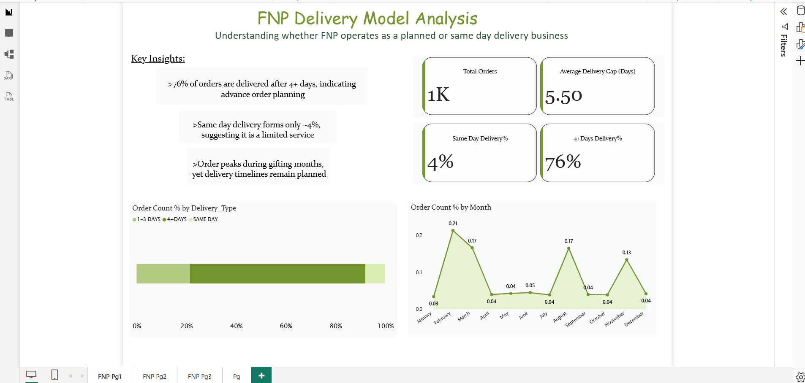
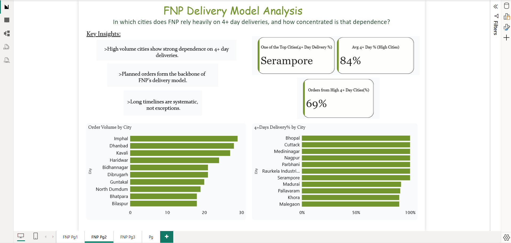
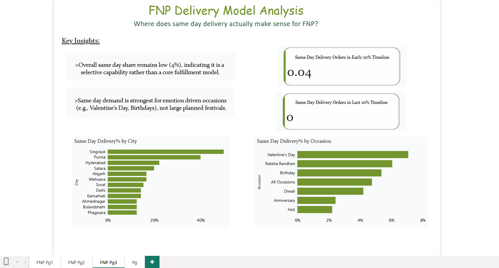

# FNP-Delivery-Model-Analysis

A Data Driven Evaluation of Planned vs Same Day Delivery Strategy

## Table of content
- <a href="#executive-summary">Executive Summary</a>
- <a href="#business-problem">Business Problem</a>
- <a href="#analysis-&-findings">Analysis & Findings</a>
- <a href="#dashboard">Dashboard</a>
- <a href="#tools-&-technologies-used">Tools & Technologies Used</a>
- <a href="#business-conclusions">Business Conclusions</a>
- <a href="#future-scope">Fututre Scope</a>
- <a href="#author-&-contact">Author & Contact</a>

<h2>Executive Summary</h2>

This project analyzes FNP’s delivery ecosystem to determine whether the company operates primarily as a same day logistics provider or a planned gifting platform.
Using orderlevel delivery timelines, citylevel distribution, and occasion-based demand patterns, the analysis reveals that:

>FNP is fundamentally a planned delivery business, with same day fulfillment functioning as a selective, emotion driven capability rather than a core operational model.

## Project Overview

* Whether FNP functions as a same day delivery company

* The extent of dependency on 4+ day planned deliveries

* Geographic concentration of delivery timelines

* Situations where same day delivery actually makes business sense

<h2>Business Problem</h2>

FNP operates in a highly emotional and occasion-driven market. From a strategic perspective, it is critical to understand:

* Is FNP positioned as a same-day logistics company?

* Or is it primarily a planned gifting platform?

* Where does same day delivery actually create value?

* How concentrated is reliance on longer delivery timelines?

Answering these questions enables better operational planning, marketing positioning, and inventory optimization.

<h2>Analysis & Findings</h2>

### 1.Overall Delivery Model Assessment

* Key Metrics:-
  - Total Orders: 1000+

  - Average Delivery Gap: 5.5 Days

  - Same Day Delivery Share: 4%

  - 4+ Days Delivery Share: 76%

* Key Insights:-
  - More than 76% of orders are delivered after 4+ days, indicating strong advance planning behavior.

  - Same day delivery accounts for only 4%, showing it is not a core operational model.

  - Orders peak during gifting months, yet delivery timelines remain largely planned.

  - The average 5.5-day gap reinforces a structured fulfillment system rather than urgent dispatch logistics.

* Conclusion:-
  - FNP primarily operates as a planned gifting and scheduled delivery platform, not a rapid same day logistics company.

### 2.City Level Delivery Dependence

* Key Observations:-

  - High volume cities show an average 84% reliance on 4+ day deliveries.

  - 69% of total orders originate from cities with high 4+ day dependency.

  - Serampore and similar cities exhibit extreme concentration of planned deliveries.

* Key Insights:-
    - Long delivery timelines are systematic, not exceptional.

    - Planned delivery forms the backbone of operations across high volume cities.

    - The logistics model is optimized for structured scheduling rather than rapid dispatch.

* Conclusion:-
    - FNP’s logistics strategy is heavily optimized around advance scheduling, especially in high volume cities.

### 3.Where Same Day Delivery Makes Sense

* Key Metrics:-

  - Overall Same Day Share: 4%

  - Same Day Orders in Last 10% of Orders: 0%

* Key Insights:-

  - Same-day delivery remains a selective capability rather than a fulfillment backbone.

  - Same day demand is strongest for emotion driven occasions:

    - Valentine’s Day

    - Raksha Bandhan

    - Birthdays

  - Large planned festivals (eg., Diwali, Holi) show lower same day demand.

  - Certain cities demonstrate higher same day adoption, but not at scale.

* Conclusion:-

  - Same day delivery is a strategic, occasion driven feature, not a scalable core model for FNP.

<h2>Dashboard</h2>

  ### Page 1 – Overall Delivery Model Assessment
  

  ### Page 2 – City Level Delivery Dependence
  

  ### Page 3 – Where Same Day Delivery Makes Sense
  

<h2>Tools & Technologies Used</h2>

* Power BI (Dashboard Visualization)

* Excel
  
* DAX / Calculated Metrics

* Data Modeling & KPI Analysis

<h2>Business Conclusions</h2>

* FNP’s True Operating Model

  - FNP is best described as:

    > A planned gifting platform with selective same day capabilities

  - Not:

    > A high speed same day logistics provider.

<h2>Future Scope</h2>

* Analyze profitability by delivery type.

* Evaluate operational cost differences between same day and planned deliveries.

* Customer segmentation based on urgency behavior.

* Predictive modeling for high demand emotional occasions.

<h2>Author & Contact</h2>

**Samiksha Dasgaonkar**
#### Data Analyst
##### Email : samikshadasgaonkar2004@gmail.com
##### [LinkedIn] (www.linkedin.com/in/samiksha-dasgaonkar)
 

